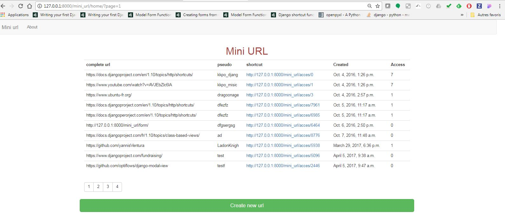

# Django_MiniUrl_Bootstrap
 url shortener with Bootstrap IHM

# Introduction

Mini url is an url shortner created with Django Framework. It allow user to generate a random url shortcut for a given url.

# Installation

## Requirement

  Python 2.7
  Django 1.10

## Lauch server

To lauchn Mini url server procced as the following :

  1. Open the project folder with your terminal.
  2. Execute ```python manage.py runserver [port]```
  3. Open your webrowser with the following url : ```http://127.0.0.1:[your_port]/mini_url/home/```

See the home page



